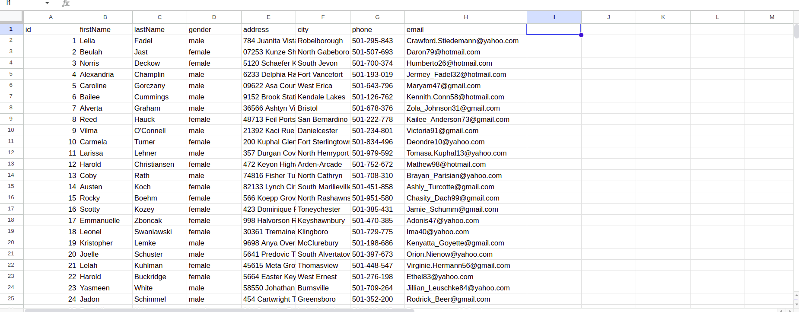

Весь код разделен на несколько сервисов:
- **[ApiService](src/common/api/api.service.ts)** — для получения взаимодействия с API.
- **[ClientsService](src/modules/clients/clients.service.ts)** — обеспечивает услуги для модуля клиентов.
- **[SheetsService](src/modules/sheets/sheets.service.ts)** — для выгрузки данных в Google Sheets.

Также настроен [Dockerfile](Dockerfile) для контейнеризации приложения и [docker-compose.development.yml](docker-compose.development.yml).

### Подробности:
- **[ApiService](src/common/api/api.service.ts)** использует [ApiService](src/common/api/api.service.ts) для получения клиентов через API.
- **[SheetsService](src/modules/sheets/sheets.service.ts)** взаимодействует с Google Sheets API для выгрузки данных в таблицы.
- **[google-credentials.json](google-credentials.json)** предоставляет конфиг для подготовленного тестового юзера.

Чтобы продолжить, выполните следующие шаги:
1. Создайте .env файл:
```bash
    touch .env
```
2. Скопируйте [.env.development](.env.development) в .env:
```bash
  cp .env.development .env
```
3. Запустите сборку: 
```bash
  docker compose -f docker-compose.development.yml up -d
```
4. Завершите процесс
```bash
  docker compose -f docker-compose.development.yml down -v
```


